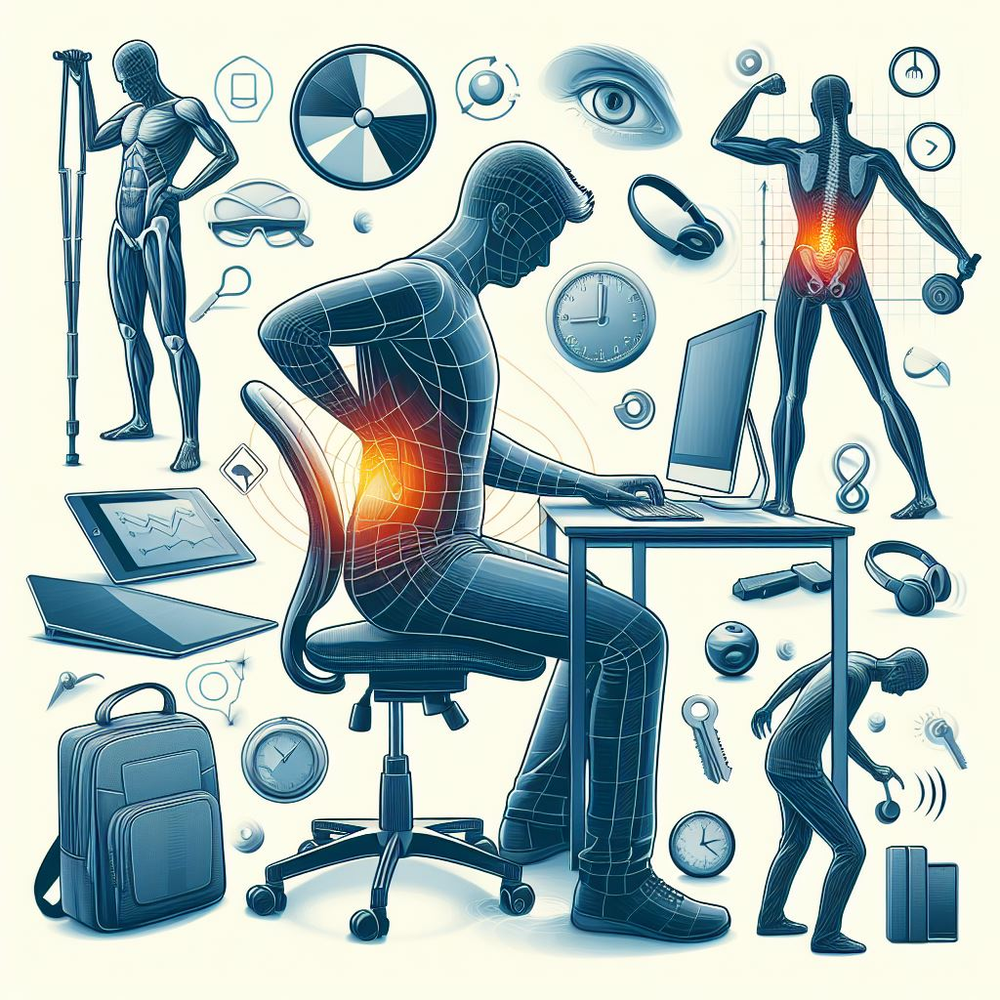

## RIESGOS LABORALES Y PREVENCIÓN EN LA INFORMÁTICA

## *ÍNDICE*

* [**RIESGOS LABORALES**](Riesgos_Laborales.md)

* [**PREVENCIÓN**](prevencionriesgos.md)

## AUTORES

* :pushpin: [Álvarez Padilla, David Manuel](https://github.com/DavidPadilla24)
* :pushpin: [Cabezuelo Expósito, Adrián](https://github.com/AdrianCE94)
* :pushpin: [David Sánchez Caicedo](https://github.com/davidlinesc)

## LICENCIA

 
This work is licensed under <a href="http://creativecommons.org/licenses/by-sa/4.0/?ref=chooser-v1" target="_blank" rel="license noopener noreferrer" style="display:inline-block;">Attribution-ShareAlike 4.0 International</a>
 
